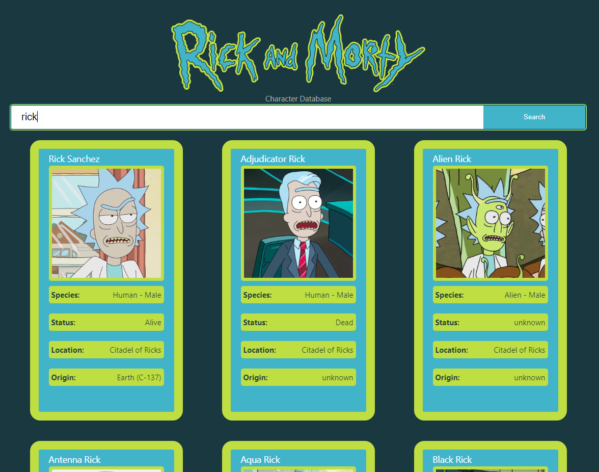

# RickAndMortyCharacters

This is a single page app that lets you utilise the [Rick and Morty API](https://rickandmortyapi.com/documentation/) to search for a character. This app includes a search bar, character cards made up from data retrieved using the API and pagination.

See my [Figma designs here](https://www.figma.com/file/FxJjM4XBrZk7Ruft1tacoH/Rick-%26-Morty-Characters?type=design&node-id=0%3A1&mode=design&t=dQHuUWcsmvdYUok1-1) which I used to give myself a quick design to try and aim towards



## Project Setup

First clone the repository to your desired location. Then first run:

```sh
yarn install
```

Once all of the packages have been installed, then run:

```sh
yarn dev
```
